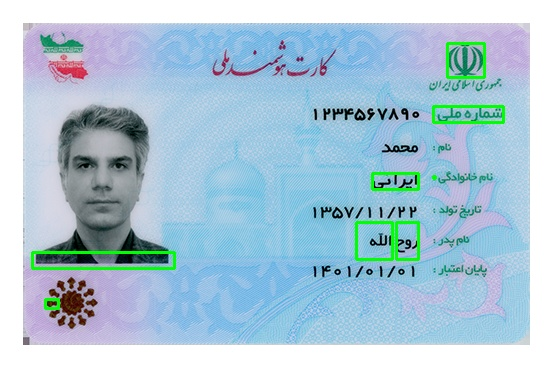

<p align="center">
  <a href="https://github.com/MohamadNematizadeh/website_PlantsAI">

  </a>
  <h2 align="center"> 
AI_Face_Verification </h2>

  <p align="center" ></p>

  <p align="center">
   The electronic identity authentication system (eKYC) uses modern technologies to authenticate users quickly, securely and online.👨‍🦰
   


## How to Install :


1. **Install Python Packages:**: 
 To install the required Python packages, use the following command:
    ```
    pip install -r requirements.txt
    ```
2. **Install Tesseract OCR:**: 
 For text recognition, you'll need to install Tesseract OCR. If you're using a Unix-based system, run the following commands:
    ```
    sudo apt-get install tesseract-ocr
    sudo apt-get install tesseract-ocr-fas
    ```

## How to Run

1. **Set Up Your Images:**: 
Use an image of the Iranian national ID for cleaned_card_image. This is done in the following line:
    ```
    cleaned_card_image = verifier.process_card(Replace with your ID image path)  
    ```
    .The text extracted will be from the same ID image:
    ```
    text = verifier.extract_text(Same ID image for OCR) 
    ```
2. **Compare Faces:**: 
Load the face image that you want to compare with the ID photo
    ```
   imag_2 = cv2.imread(Replace with the path of the face image)  
    ```
3. **Run the Verification Script:**: 
   ```
    python main.py 
    ```